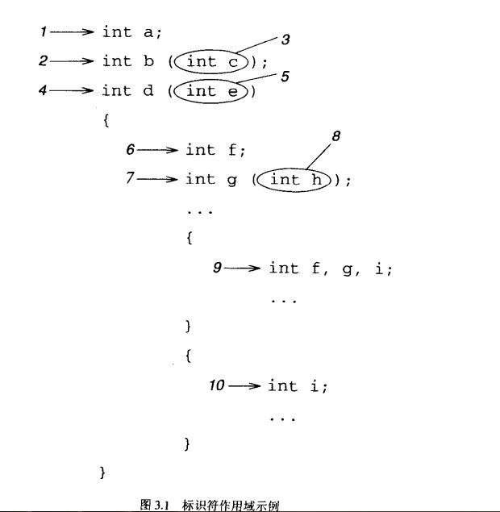
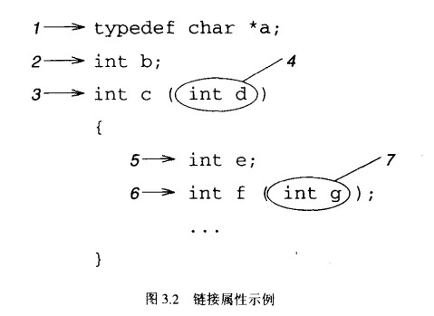
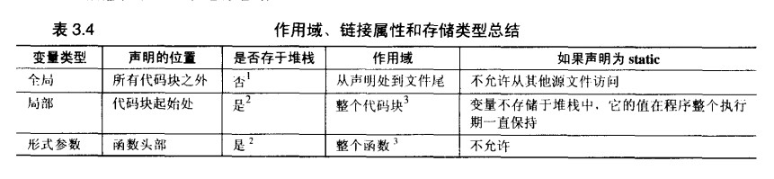

### 3 数据
1. 基本数据类型
   1. 整型 字符，短整型，整型，长整型	singed,unsigned  
      - **字面值（literal）** **命名常量**（const） **枚举（enumerated）**
      - limits.h 
   2. 浮点类型  float.h
   3. 指针 
      - 指针常量（pointer constant） 
      - 字符串常量（string literal）
   4. 聚合类型（数组，结构等）
2. 基本声明
   1. 变量声明基本形式： *说明符（一个或多个）  声明表达式列表*
   2. 初始化		int j=11;
   3. 声明简单数组	int values[10];
   4. 声明指针	`int *b, *c, *d;
   5. 隐式声明	类型名省略默认为整型
3. typedef	为各种数据类型定义新名字
` typedef char *ptr_to_char;  
  ptr_to_char	a;`  
  `#define`不能正确处理指针类型：`#define d_ptr_to_char char *`  
  `d_ptr_to_char a, b;`
4. 常量
   - `int const a;` 等价 1 `const int a;`
   - `int const a = 15;`
   - `int *pi;`
   - `int const *pci;` 一个指向整型常量的指针（可以修改指针的值，不能修改其所指向的值）
   - `int * const cpi;` 一个指向整型的常量指针（指针值无法修改，其所指向的整型值可以修改）
   - `int const * const cpci;`
   - 也可用#define 定义名字常量：`#define MAX_ELEMENTS 50` 。
   - #define定义的名字常量在使用字面值常量的地方都可以使用；const变量只能用于使用变量的地方。
5. 作用域（scope） 
   
    

   - 代码块作用域 花括号（6,7,9,10） 和  形参（5）
      + 在任何时刻，两个非嵌套的代码块最多只有一个处于活动状态
   - 文件作用域  代码块之外声明的标识符 和 函数名
      + `#include`指令就好像把一个文件直接写在另一个文件中一样
   - 原型作用域
   - 函数作用域  只适用于语句标签（goto语句）
      + 一个函数中的所有语句标签必须唯一

6. 链接属性（linkage）  

   - 标识符的**链接属性**决定如何处理在不同文件中出现的标识符
   - 3种链接属性：
      + **none** ： 多个声明被当作独立不同的实体。
      + **inernal** ： 在同一源文件内的所有声明是同一实体，不同源文件是不同实体
      + **external** ： 不论声明多少次，位于几个源文件都表示同一个实体。  
     
   - 默认，在3.2图中b，c，f的链接属性为external，其余是none。在这个源文件中调用函数f，实际上将链接到其他源文件所定义的函数，甚至这个函数的定义可能出现在某个函数库。
   - `extern`和`static`用于在声明中修改标识符的链接属性。    
      + `static`只对默认链接属性为`external`的声明才有改变链接属性的效果。  
7. **存储类型（storage class）**  存储变量值的内存类型
   - 变量存储类型决定变量*何时创建*，*何时销毁*，*值保存时间*
   - 变量的默认存储类型取决于它的声明位置
      + 任何代码块之外，*静态内存*（不属于堆栈），*静态变量*
      + 在代码块内部声明，*堆栈*，*自动变量*
      + `static` 自动变量转变为静态变量
      + 修改变量的存储类型并不表示修改该变量的作用域
      + `register` **寄存器变量** 编译器决定
   - 初始化
      + 静态变量初始化，初始值的位置确定，不需要额外的时间和指令，如果不是显式地指定其初始值，静态变量将初始化为0.
      + 自动变量初始化的4中后果：
         * 除了const变量，声明和赋值是否同时只是风格之差，并无效率之别。
         * 每次都重新初始化。
         * 初始化在运行时执行，可用表达式作为初始化值。
         * 不是显式初始化时，值总是垃圾
8. static关键字
   - 函数定义和代码块之外时，修改标识符的链接属性（external->inernal），但标识符的存储类型和作用域不受影响
   - 代码块内部时，自动变量修改为静态变量，但变量的链接属性和作用域不受影响。
10. 总结
   - 如果一个变量声明于代码块内部，在它前面添加extern关键字将使它所引用的是全局变量。
   
13. 习题
   - extern可置于变量或者函数前，以表示变量或者函数的定义在别的文件中，提示编译器遇到此变量和函数时在其他模块中寻找其定义。另外，extern也可用来进行链接指定。
   - 13.22 Inside: the variable is automatic, it is reinitialized each time the function is called, its scope is limited to the function, it has no linkage. Outside: the variable is static, it is initialized only once before the program begins to run, it has file scope, and external linkage.
   - 文件作用域是有顺序的，就是变量使用必须在声明赋值之后。
  

 