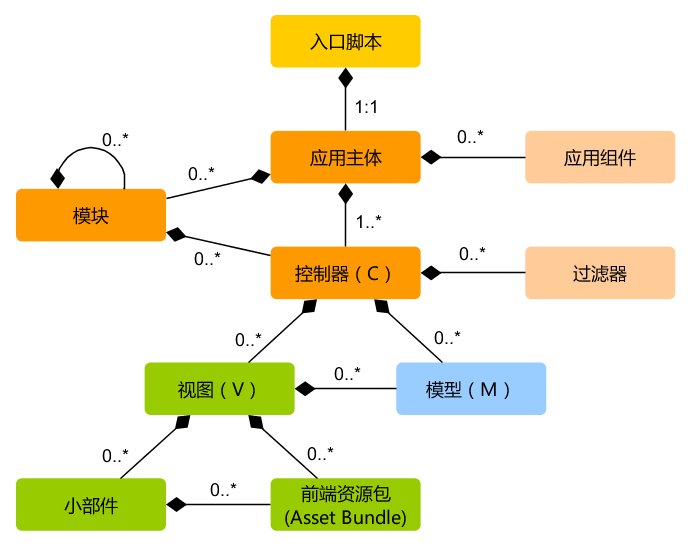

### 应用结构
- 总览

- 入口脚本
	+ index.php	yii(/yii.bat)
	+ 入口内容
		* 定义全局常量；
		* 注册 Composer 自动加载器；
		* 包含 [[Yii]] 类文件；
		* 加载应用配置；
		* 创建、配置、运行一个**应用主题**  `(new yii\web\Application($config))->run();`
	+ Yii的类自动加载机制
		* 在Yii中，所有类、接口、Traits都可以使用类的自动加载机制实现在调用前自动加载。类仅在调用时才会被加载，特别是核心类
		* Yii的类自动加载，依赖于PHP的 spl_autoload_register() ， 注册一个自己的自动加载函数（autoloader），并插入到自动加载函数栈的最前面，确保Yii的autoloader会被最先调用。
		* 入口脚本中
		
				// 这个是第三方的autoloader（默认是composer）
				require(__DIR__ . '/../../vendor/autoload.php');
				
				// 这个是Yii的Autoloader，放在最后面，确保其插入的autoloader会放在最前面
				require(__DIR__ . '/../../vendor/yiisoft/yii2/Yii.php');
				// 后面不应再有autoloader了
		* `Yii.php`:
		
				<?php
				require(__DIR__ . '/BaseYii.php');
				class Yii extends \yii\BaseYii
				{
				}
				
				// 重点看这个 spl_autoload_register
				spl_autoload_register(['Yii', 'autoload'], true, true);
				
				// 下面的语句读取了一个映射表
				Yii::$classMap = include(__DIR__ . '/classes.php');
				
				Yii::$container = new yii\di\Container;
			
			- `BaseYii:autoload()`被注册为autoloader，也可在Yii类中重载autoload()方法来是吸纳自己的加载机制
			- `classes.php`文件保存了一系列的核心类名与其所在PHP文件的映射关系（这样核心类的加载是快的）

- 应用主体
	+ 应用主体是管理 Yii 应用系统整体结构和生命周期的对象。 每个Yii应用系统只能包含一个应用主体，通过表达式 \Yii::$app 全局范围内访问
	+ [[yii\web\Application|网页应用主体]] and [[yii\console\Application|控制台应用主体]]
	+ **应用主题属性**
		* [[yii\base\Application::id|id]]	`\Yii::$app->id;`(如basic)
		* [[yii\base\Application::basePath|basePath]]	`@app`(别名)
		* [[yii\base\Application::aliases|aliases]]
		* [[yii\base\Application::bootstrap|bootstrap]]	用数组指定启动阶段需要运行的组件
		* [[yii\web\Application::catchAll|catchAll]]
		* **[[yii\base\Application::components|components]]**	`print_r(\Yii::$app->components);`	注册过的的**应用组件**  
			用`\Yii::$app->request` `\Yii::$app->cache`等访问
		* [[yii\base\Application::controllerMap|controllerMap]]	指定一个控制器ID到任意控制器类。默认是对应控制器的，如`post`对应`app\controllers\PostController`
		* [[yii\base\Application::controllerNamespace|controllerNamespace]] 指定控制器类默认的命名空间（默认为app\controllers）
		* [[yii\base\Application::language|language]] 指定应用展示给终端用户的语言
		* [[yii\base\Application::modules|modules]] 指定应用所包含的模块
		* [[yii\base\Application::name|name]] 指定你想展示给终端用户的应用名称
		* [[yii\base\Application::params|params]] 指定可以全局访问的参数
		* [[yii\base\Application::sourceLanguage|sourceLanguage]] 指定应用代码的语言
		* [[yii\base\Application::timeZone|timeZone]]	` date_default_timezone_set()`
		* [[yii\base\Application::version|version]]
		* [[yii\base\Application::charset|charset]]
		* [[yii\base\Application::defaultRoute|defaultRoute]]  默认路由
		* [[yii\base\Application::extensions|extensions]]  `@vendor/yiisoft/extensions.php`
		* [[yii\base\Application::layout|layout]]  指定渲染 视图 默认使用的布局名字
		* [[yii\base\Application::layoutPath|layoutPath]]
		* [[yii\base\Application::runtimePath|runtimePath]]	`@app/runtime`	`@runtime`
		* [[yii\base\Application::viewPath|viewPath]] `@app/views`
		* [[yii\base\Application::vendorPath|vendorPath]] `@app/vendor` `@vendor`
		
	+ 应用事件
	+ 应用主体生命周期
		1. 入口脚本加载应用主体配置数组。
		2. 入口脚本创建一个应用主体实例：
			* 调用 [[yii\base\Application::preInit()|preInit()]] 配置几个高级别应用主体属性，比如[[yii\base\Application::basePath|basePath]]。
			* 注册 [[yii\base\Application::errorHandler|error handler]] 错误处理方法.
			* 配置应用主体属性.
			* 调用 [[yii\base\Application::init()|init()]] 初始化，该函数会调用 [[yii\base\Application::bootstrap()|bootstrap()]] 运行引导启动组件.
		3. 入口脚本调用 [[yii\base\Application::run()]] 运行应用主体:
			* 触发 [[yii\base\Application::EVENT_BEFORE_REQUEST|EVENT_BEFORE_REQUEST]] 事件。
			* 处理请求：解析请求 路由 和相关参数；创建路由指定的模块、控制器和动作对应的类，并运行动作。
			* 触发 [[yii\base\Application::EVENT_AFTER_REQUEST|EVENT_AFTER_REQUEST]] 事件。
			* 发送响应到终端用户.
		4. 入口脚本接收应用主体传来的退出状态并完成请求的处理。

- 应用组件
	+ 应用组件只会在第一次访问时实例化
	+ 引导启动组件：想在每个请求处理过程都实例化某个组件即便它不会被访问， 可以将该组件ID加入到应用主体的 [[yii\base\Application::bootstrap|bootstrap]] 属性中。
	+ 核心应用组件
		* yii\web\AssetManager ： 管理资源包和资源发布
		* yii\web\ErrorHandler ： 处理 PHP 错误和异常
		* yii\db\Connection
		* yii\i18n\I18N ： 支持信息翻译和格式化
		* yii\log\Dispatcher ： 管理日志对象
		* yii\swiftmailer\Mailer ：  支持生成邮件结构并发送
		* yii\web\Session 
		* yii\web\User|user ： 代表认证登录用户信息
		* yii\web\View ： 支持渲染视图
		* yii\web\UrlManager
		* yii\web\Request
		* yii\web\Response