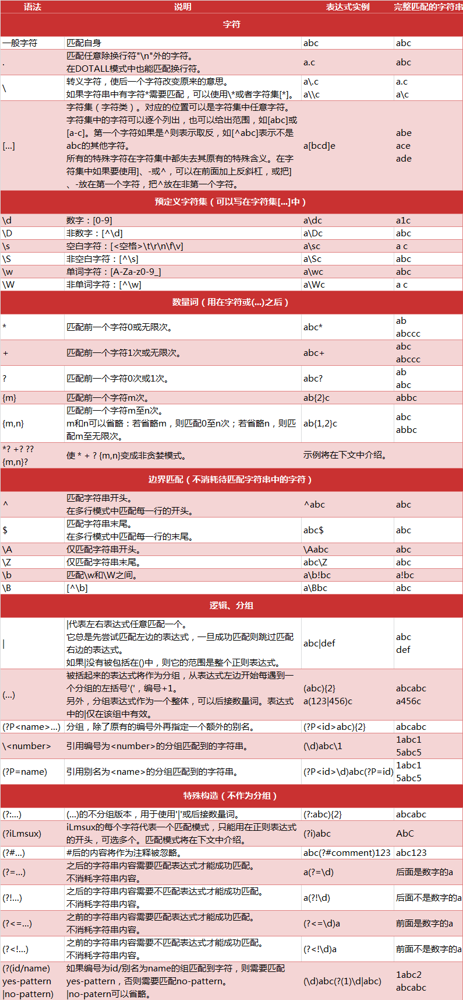

[Python爬虫入门](http://python.jobbole.com/81332/)
----------------------------

- Urllib库的使用
    + 抓网页
            
            import urllib2
 
            response = urllib2.urlopen("http://www.baidu.com")
            print response.read()

    + 构造Requset
    + POST和GET数据传送
    + 设置header   
    对付”反盗链”的方式，对付防盗链，服务器会识别headers中的referer是不是它自己，如果不是，有的服务器不会响应

            User-Agent : 有些服务器或 Proxy 会通过该值来判断是否是浏览器发出的请求
            Content-Type : 在使用 REST 接口时，服务器会检查该值，用来确定 HTTP Body 中的内容该怎样解析。
            application/xml ： 在 XML RPC，如 RESTful/SOAP 调用时使用
            application/json ： 在 JSON RPC 调用时使用
            application/x-www-form-urlencoded ： 浏览器提交 Web 表单时使用
            在使用服务器提供的 RESTful 或 SOAP 服务时， Content-Type 设置错误会导致服务器拒绝服务
    + Proxy（代理）的设置
    + Timeout 设置
        
            response = urllib2.urlopen('http://www.baidu.com', timeout=10)
            response = urllib2.urlopen('http://www.baidu.com', data, 10)
    + 使用 HTTP 的 PUT 和 DELETE 方法
    
            import urllib2
            request = urllib2.Request(uri, data=data)
            request.get_method = lambda: 'PUT' # or 'DELETE'
            response = urllib2.urlopen(request)
    + 使用DebugLog

- 异常处理
    + URLError
        * 原因
            - 网络无连接，即本机无法上网
            - 连接不到特定的服务器
            - 服务器不存在
    + HTTPError (URLError的子类)

- Cookie的使用

- 正则表达式
    + Python中正则表达式的一些匹配规则: 
          
    + Python里数量词默认是贪婪的
    + Python中用 **原生字符串** 就不用`\`来转义了
    + Python Re模块
        - 主要用法  

                #返回pattern对象
                re.compile(string[,flag])  
                #以下为匹配所用函数
                re.match(pattern, string[, flags])
                re.search(pattern, string[, flags])
                re.split(pattern, string[, maxsplit])
                re.findall(pattern, string[, flags])
                re.finditer(pattern, string[, flags])
                re.sub(pattern, repl, string[, count])
                re.subn(pattern, repl, string[, count])
        
        参数flag是匹配模式，取值可以使用按位或运算符’|’表示同时生效，比如re.I | re.M。

                 • re.I(全拼：IGNORECASE): 忽略大小写（括号内是完整写法，下同）
                 • re.M(全拼：MULTILINE): 多行模式，改变'^'和'$'的行为（参见上图）
                 • re.S(全拼：DOTALL): 点任意匹配模式，改变'.'的行为
                 • re.L(全拼：LOCALE): 使预定字符类 \w \W \b \B \s \S 取决于当前区域设定
                 • re.U(全拼：UNICODE): 使预定字符类 \w \W \b \B \s \S \d \D 取决于unicode定义的字符属性
                 • re.X(全拼：VERBOSE): 详细模式。这个模式下正则表达式可以是多行，忽略空白字符，并可以加入注释。

        - re.match(pattern, string[, flags])
            * 将会从string（我们要匹配的字符串）的开头开始，尝试匹配pattern，一直向后匹配，如果遇到无法匹配的字符，立即返回 None，如果匹配未结束已经到达string的末尾，也会返回None。
        - re.search(pattern, string[, flags])
            * match()函数只检测re是不是在string的开始位置匹配，search()会扫描整个string查找匹配，match（）只有在0位置匹配成功的话才有返回，如果不是开始位置匹配成功的话，match()就返回None。同样，search方法的返回对象同样match()返回对象的方法和属性。
        - re.split(pattern, string[, maxsplit])
            * 按照能够匹配的子串将string分割后返回列表。maxsplit用于指定最大分割次数，不指定将全部分割。
        - re.findall(pattern, string[, flags])
            * 搜索string，以列表形式返回全部能匹配的子串。
        - re.finditer(pattern, string[, flags])
            * 搜索string，返回一个顺序访问每一个匹配结果（Match对象）的迭代器。
        - re.sub(pattern, repl, string[, count])
            * 使用repl替换string中每一个匹配的子串后返回替换后的字符串。
            当repl是一个字符串时，可以使用\id或\g、\g引用分组，但不能使用编号0。
            当repl是一个方法时，这个方法应当只接受一个参数（Match对象），并返回一个字符串用于替换（返回的字符串中不能再引用分组）。
            count用于指定最多替换次数，不指定时全部替换。
        - re.subn(pattern, repl, string[, count])
            * 返回 re.sub的结果和替换次数的元组
    + Python Re模块的另一种使用方式
        * `pattern.match()`

- Beautiful Soup的用法 [中文文档](https://www.crummy.com/software/BeautifulSoup/bs4/doc/index.zh.html)
    + 安装 Beautiful Soup  https://pypi.python.org/pypi/beautifulsoup4/4.3.2 
        * `wget https://pypi.python.org/packages/30/bd/5405ba01391d06646de9ec90cadeb3893fa355a06438966afff44531219a/beautifulsoup4-4.3.2.tar.gz`
        * `tar -xvf `
        * `sudo python setup.py install`
    + 安装 lxml 
        * `pip install lxml`

--------------

### 
