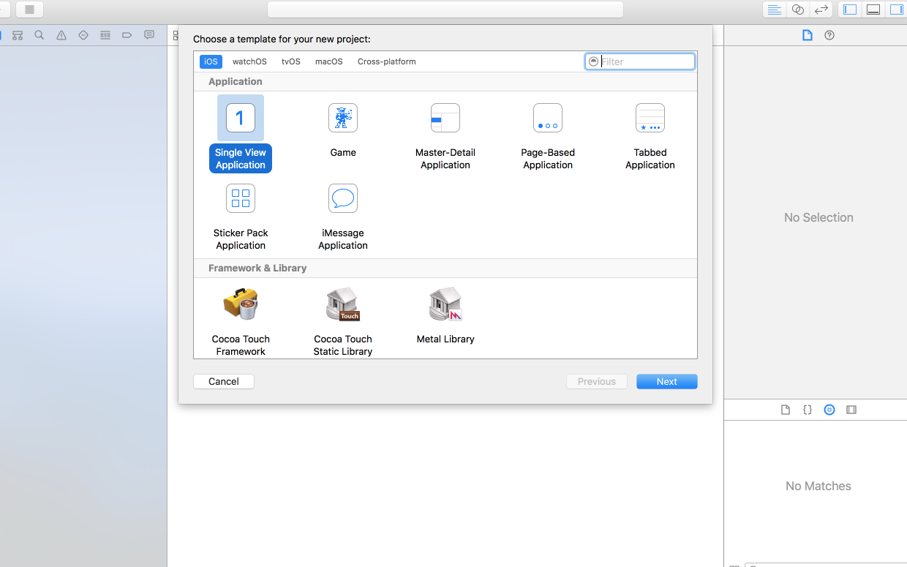
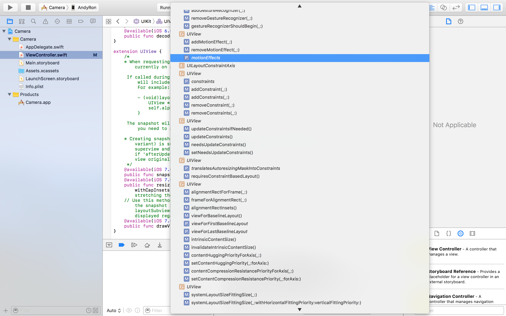

Beginning iPhone Development with Swift
----------------

### 1 欢迎到swift丛林
- *沙盒*  应用用于存储文档、首选项等任何必要数据的地方

### 2 Hello World
1. 新建项目：**New > Project**(command+shift+N)
2. 选择 **iOS > Application > Single View Application**
    
3. 填写相关参数
    Product Name

    Team

    Organization Name

    Organization Identifier
    Bundle Identifier 
    Language
Devices  
4. 创建项目   (img)
    Source Control 
5. xcode介绍
    1. toolbar
        * 活动视图(activity view)   中间
        * 右侧(左边三个)  用于切换
            + standard editor
            + assistant editor
            + version editor
    2. navigator
        * project navigator(源代码文件、图片文件、数据模型、属性列表等)
        * symbol navigator(编译器能识别的：OC类、枚举类型、结构体、全局变量)
        * find navigator
        * issues navigator
        * test navigator
        * debug navigator
        * breakpoint navigator
        * log navigator
    3. jump bar(跳转栏)  
        Recent Files, Unsaved Files, Counterparts(关联文件), Superclasses(父类), Subclasses, Siblings(兄弟类), Categories(类别), Include（引用文件)...
    4. The Utility Area(实用工具面板，右侧)
        * Attributes Inspector(属性检查器)
        * Library
            + file template
            + code snippet
            + object
            + media
    5. Interface Builder(界面构建器)
    6. New Compiler and Debugger
        - LLVM(Low Level Virtual Machine, 底层虚拟机)
        - static analyzer(静态分析器)Xcode

    The Jump Bar   counterparts
    floader     logical grouping
    + nib文件
    + storyboard头部
        - View Controller   The task of the view controller is to manage what the user sees on the screen.
        - First Responder   the object with which the user is currently interacting
        - Exit


6. 构建
    - AppIcon 
    - 图片用png
    - launch file   LaunchScreen.storyboard

- 界面构建器
    + 文件格式的演变
        * nib(二进制)
        * xib(xml)
        * storyboard(分镜，xml,“元nib文件”)：可以包含多个视图和控制器，以及如何在应用运行时相互连接的配置信息
    + 分镜
        * 屏幕上显示的所有用户界面元素(包括按钮、文本框、标签等)都继承自UIView
    + 库
    + 按钮和其他很多控件都不包含子视图
    + 界面构建器不会生成任何需要手动维护的代码
    + 把对象序列化到分镜或nib文件中

- 美化应用
    - 像素(ppt, pixels per inch), 点(pt, point)
    - 58 80 120 
- Xcode快捷键和常用菜单
    + `command + 0  ~  command + 8` 分别对应navigator
    + `command + option + 0  ~  command + option + 6` 对应 Attributes Inspector
    + `command + option + control + 0  ~  command + option + control + 4`  对应 Library
    + `Command + Shift + o`  切换至某个文件或者找到特定的代码行
    + `option + command + return`(View>Assistant Editor>Show Assistant Editor) 打开辅助编辑器
    + `Editor>Canvas>Show Bounds Rectangles`   显示控件边框
    + `Editor>Resovle Auto layout issues>Add Missing Constraints`  添加限制
    + `Command+Shift+C` 打开控制台
    + `command＋shift＋O` 打开（搜索）头文件
    + `control+command+Up` 对应文件的切换
    + `Command + Shift + 0`  文档界面
    + `command+B` build app
- 专有名词、概念等
    - iOS Human Interface Guidelines(HIG)
    - **第一响应者** ：当前正在与用户进行交互的控件


### 3 Handling Basic Interaction 实现基本交互
`NSMutableAttributedString` < `NSAttributedString`
`NSRange`
1. MVC 范例
2. 理解 **Outlets**, **Actions** 
    - xcode中创建outlets和actions的方法： Assistant View
    - Outlets
        + @IBOutlet 的作用：
            * swift编译不做任何特殊处理
            * 告诉Xcode，这个属性会与nib文件中的对象关联
        + weak这个区分符：弱引用
    - Actions
        + 没有参数
        + 只接受一个参数(指向触发该方法的对象的指针，sender)
3. 创建项目**Button Fun** 
    1. 创建 **Single View Application** 
    2. 清理 `ViewController`
    3. 设计 the User Interface
        + Xcode 对按钮和操作方法等的关联信息存储在分镜文件中。
        + 添加buttons和action
        + 添加label和Outlet
        + 写完Action Method
        + 调整视图布局(最新的xcode版本已经优化过，一般的视图都兼容了)
            * **Update Frames**  **Size to Fit Content**
            * *correct runtime locations* **Resolve Auto Layout Issues**

    4. 预览布局
        + 编辑区左上角 **Preview**， 结合左下角的设备选择
    5. 添加样式
4. 应用程序委托
    - **委托(delegate)**：负责为其他对象处理特定任务的对象
    - 每个iOS应用程序都有且仅有一个UIApplication实例，它负责应用程序的运行循环，以及处理应用程序级的功能(比如把输入信息分发给恰当的控制器类)。
    - 在应用程序执行过程中的某些特定时间点，UIApplication将会调用特定的委托方法(如果委托对象存在，并且实现了相应的委托方法)。


### 4 More User Interface Fun
- Active, Static, Passive
    + 界面的控制有三个基本的模式：活动，静止，被动
    + 大多数控件都支持被动模式，并且所有控件都支持静态或者不可见模式。
    + 所有iOS控制都是`UIControl`的子类
    + 如果一个控件可以触发多个操作方法，可能会导致应用出现意料之外的行为。
    + iOS和Mac中控制的不同
- 创建应用**Control Fun**
    1. 添加 `Image View`
    2. 改变`Image View`的**Content Model**属性从*Scale To Fill*到*Center*，用图片的原始尺寸（不要压缩或拉伸）
    3. 选中`Image View`，**Command+=**（**Editor -> Size to Fit Content** ）;使`Image View`的大小适应于图片的大小
    4. 重新拖动`Image View`到合适位置
    5. 选中`Image View`，添加**Horizontal Center in Container**
    6. 设置`Image View`的`View`节的属性（由于`UIImageView`是`UIView`的子类，这边的`View`节属性是共有的）
        + **Content Mode**  建议用原图尺寸，不要拉伸等？？
        + **Semantic** 语法属性就是文字开始的方向 `semanticContentAttribute `
        + **Tag** 整数，运行时不能改变，方便写程序是区分调用
        + **Interaction**   
            **Interaction**  
            **Interaction**  
        + **Alpha**
        + **Background**
        + **Tint**
        + **Drawing**
    7. 添加两个`Text Fields`和两个`Label`
        + `Text Fields`的属性
            * **Clear Button** 是右边的删除标志
            *
    8. 添加Constraints
    9. 创建链接接口
    10. 关闭键盘
        + 当按键盘return或done时,`Text Field`注销掉FirstResponder(键盘就会隐藏)，`Text Field`的`Did End On Exit`事件。添加完@IBAction后，到`Text Field`的** the connections inspector**中拖到` Did End On Exit`事件到**View Controller**上，并选择`textFieldDoneEditing`，就关联起来了
        ```    
        @IBAction func textFieldDoneEditing(sender: UITextField) {
            sender.resignFirstResponder()
        }
        ```
        + 触摸背景关闭键盘
            * 拖动`Tap Gesture Recognizer`进入container view
            * Control-drag `Tap Gesture Recognizer` 到 ViewController.swift得到Action，同时注销两个Text Field的FirstResponder
    11. 添加`Slider`和`Label` 
        + Actions Outlets
    12. Switches, Button, and Segmented Control
        + 添加`Segmented Control`
        + 添加两个`Switch`, Actions Outlets
        + 添加 **Segmented Control** 按钮
    


### 5 Rotation and Adaptive Layout
- The Mechanics of Rotation
	+ immersive apps
	+ landscape orientation   portrait orientation
- 两种视图自动旋转的支持方式
	+ Supported Orientations at the App Level
		- interface orientation   device orientation
- Designing an Interface Using Constraints
	+ **trailing space**  尾部(一般右边)
	+ **leading space**   头部(一般左边)
	+  `Editor ➤ Resolve Auto Layout Issues ➤ Add Missing Constraints`  *ALl Views* and *Selected Views* ?
	+  missing constraint  可以理解为必要的、不可缺少的限制
	+  orange lines   means not match(the current postion and at runtime) constraint导致
- Creating Adaptive Layouts
	+ **Size Classes**
	+ Create the iPhone Landscape Layout\*\*
...

### 6 Multiview Applications
- Common Types of Multiview Apps
	+ **tab bar**   the bottom of the Phone or Music application
	+ **toolbar**   main Safari view
	+ **navigation bar**  the top of Music application(MY Music)
	+ `UIKit`  `UITabBarController`  `UINavigationController`
- The Architecture of a Multiview Application 
	+ **The Root Controller**
- Building View Switcher
	+ `ViewController.swift` \> `Switching ViewController.swift`
	+ 把view controller 的**Class**改为**Switching ViewController**
	+ 添加`BlueViewController.swift`和`YellowViewController.swift`
	+ Building a View with a Toolbar
	+ Linking the Toolbar Button to the View Controller
	+ Writing the Root View Controller
		* **Lazy loading**
	+ Implementing the Content Views
		1. 从Object Library 拖出 **View Controller**. 在*Identity Inspector*中修改class为*BlueViewController*,并填写*Storyboard ID*为**Blue**(与代码中对应).  
			*storyboard中的箭头是指默认scene，当然这个箭头是可以移动的*   
		2. 在*Attributes Inspector*中修改*background*为蓝色(随意).
		3. 添加button在正中央  Press Me ，添加constraints,Touch Up Inside  blueButtonPressed
		4. 改变button的 **Text Color**
		5.  重复
	+ Animating the Transition

### 7 Tab Bars and Pickers

- The Pickers Application
	1. Date picker
	2. Single-component picker
	3. Multicomponent picker
	4. Picker with dependent components
	5. Custom picker with images
- Delegates and Data Sources
	+ date picker 不能只是从对象库中拖出，还要有代理和数据源
- Creating the Pickers Application 
	1. create Pickers
	2. 在Pickers文件夹中创建五个新view控制器  
		DatePickerViewController  
		SingleComponentPickerViewController  DoubleComponentPickerViewController   DependentComponentPickerViewController  CustomPickerViewController
	3. Creating the Tab Bar Controller
		+ 修改viewController的基类为`UITabBarController` 
		+ 删除storyboard原本的view controller，添加**Tab Bar Controller**
		+ 选择roo controller： **Tab Bar Controller** 勾上 **Is Initial View Controller** ；class 改为 ViewController
		+ 添加图片
		+ 修改child view controllers 的 tab bar item 的 title和Image
		+ adding three more view controllers;  
			并关联：Control-drag from the tab bar controller to your new view controller(注意是从tab bar controller向新的托)  view controllers from the **Relationship Segue**
		分别修改title和image
		+ 链接五个scene到对应的viewController
- Implementing the Date Picker

- Implementing the Single-Component Picker

- Implementing a Multicomponent Picker

- Implementing Dependent Components 
	+ 添加数据源和代理
	+ 添加一些属性
	+ build the content view  与之前的类似  
		dependentPicker  onButtonPressed  Auto Layout constraints
	+ statedictionary.plist

- Creating a Simple Game with a Custom Picker 
	+ 消除**User Interaction Enabled**这个选项使用户不能控制picker

### 8 Introduction to Table Views

- Tabel View Basics
	+ `UITableView`, `UITableViewCell`, `UITableViewDelegate`, `UITableViewDataSource`   
	+ 一个`UITableViewCell`中可以放许多数据    
	+ Grouped and Plain Tables
	+ Implementing a Simple Table
		* create new project 
		* drag a Table View to View window
		* add Constraints
		* makes controller class both the data source and delegate
		* writing the controller
		* adding the image
		* using table view  cell styles
			- `UITableViewCellStyle`
			- `Image`  `Text label` `Detail text label`
		* Setting the Indent Level (设置缩进风格)
		* Handling row selection （操作row的选择）
		* Changing the Font Size and Row Height
	+ Customizing Table View Cells （改造Table View Cells）
		- 三个方法
			* 加载一个子UITableViewCell
			* 载入一个 nib 文件
			* 载入一个 storyboard 
		- Adding Subviews to the Table View Cell
			* 创建新项目Table Cells
			* main.storyboard  添加 `Table View`
			* `dataSource` `delegate` 到 `View Controller`
			* constraints
		- Creating a UITableViewCell Subclass
			* Adding New Cells 
				+ 创建新文件 `Cocoa Touch Class`, 
				+ 在 NameAndColorCell.swift 中添加 两个属性和接口
						class NameAndColorCell: UITableViewCell {
						var name: String = ""
						var color: String = ""
						var nameLabel: UILabel!
						var colorLabel: UILabel!
				+ init
			* Implementing the Controller's Code ??
		- Loading a UITableViewCell from a Nib

### 9 Navigation Controllers and Table Views
- Navigation Controller Basics  
    > the child view controllers of a `UINavigationController are organized in a stack` 
    
	+ Stacky Goodness  
        **last in, first out.** 
	+ A Stack of Controllers
	+ Fonts: A Simple Font Browser
		* Meet the Subcontrollers
			- The Font List Controller  
			- The Font Sizes View Controller
			- The Font Info View Controller
		* The Fonts Application’s Skeleton
			- Setting up the Navigation Controller  
				`UINavigationController`:管理 view controllers 的 stack

				+ 选择 Main.storyboard
				+ 删除 basic view controller ，使storyboard为空
				+ 拖动 `UINavigation Controller` 到编辑区（实际得到两个：UINavigation Controller, Root View Controller）
				+ 选中左边的`UINavigation Controller`, 打开**the Attributes Inspector** 勾选 **Is Initial View Controller**, 让应用启动时调用这个控制器
				+ 修改 `Root View Controller` 的 title 为 `Fonts`.
				也要修改`Navigation Item`的 Title为`Fonts`?
			- Keeping Track of Favorites
				+ 建立新文件 "FavoritesList.swift"
	+ Creating the Root View Controller
	+ Initial Storyboard Setup
	+ First Subcontroller: The Font List View
		* Storyboarding the Font List
		    - 添加一个新的 `Table View Controller` 到 `Main.storyboard`的编辑区
            - 选择这个新的table view controller,通过身份检查器设置**class**为**FontListViewController**
            - 选择新的table view controller下的`Table View Cell`, 修改**Style**为*Subtitle*, **Identifier**为*FontName*, **Accessory**为*Detail Disclosure*

            - Control-dragging 两个cell到 `FontListViewController`
            - 
        * Making the Root View Controller Prepare for Segues
    + Creating the Font Sizes View Controller
        * Storyboarding the Font Sizes View Controller
            - Control-drag `FontListViewController`中的cell到 `FontListViewController`, 弹出菜单选择 **Selection Segue** 的 **show**
        * Making the Font List View Controller Prepare for Segues
    + Creating the Font Info View Controller
    
        * Storyboarding the Font Info View Controller
            - 添加 `View Controller` **class** 为 `FontInfoViewController`
            - 添加 3个`label`, 1个`swithc`, 1个`slider`
            - 修改上面的`label`的 **Lines** 为 0;修改另外两个`label`为 `right-align`;修改`slider`的**Minimum**为1, **Maximum**为200
            - 选中`FontInfoViewController`，打开连接检查器。
            - 关联 `Outlets`  
                拖动`fontSampleLabel`到上面的`label`  
                拖动`fontSizeLabel`到下面右边`label`  
                拖动`favoriteSwitch`  
                拖动`fontSizeSlider`
            - 关联 `Actions`  
                拖动`slideFontSize` 弹出菜单选中**Value Changed**  
                拖动`toggleFavorite` 弹出菜单选中**Value Changed** 
            - 创建过渡或"转场"(segue) 
                Control-drag `Font List View Controller`里的table cell 到 `FontSizesViewController`, 弹出菜单选择 **Accessory Action** 的 **show**  
                修改`Font List View Controller`到`Font Sizes View Controller`的segue的**Identifier**为**f**   
                修改`Font List View Controller`到`Font Info View Controller`的segue的**Identifier**为**ShowFontInfo** 
        * Setting Up Constraints
            - 给上面的label增加3 Constraints
        
        * Adapting the Font List View Controller for Multiple Segues
        * My Favorite Fonts
    ?? 运行报错 the Font Info View Controller 应该是这个问题
    + Table View Niceties
        * Implementing Swipe-to-Delete
        * Implementing Drag-to-Reorder

### 10 Collection View and Stack View 
    
- Creating the DialogViewer Project 
    + 建立单页项目 **DialogViewer**
    + 修改 `ViewController` 的父类为 `UICollectionViewController`
    + 选中`Main.storyboard`, 删除 ` View Controller `, 添加 `Collection View Controller `
    + 修改`Collection View Controller `的 **Class** 为 **ViewController** 
    + 勾选** Is Initial View Controller **
- Defining Custom Cells 
    
- Configuring the View Controller 

- Providing Contetnt Cells

- Making the Layout Flow

- Providing Header Views 

- Working with UIStackView 


### 11 Using Split Views and Popovers


### 12 Applicatoin Settings and User Defaults
    

### 13 Basic Data Persistence
        
 - 应用的沙盒
    + `~/Library/Developer/CoreSimulator/Devices/`
    + `data/Containers/Data/Application`
    + `~/Library/Developer/CoreSimulator/Devices/*guid*/data/Containers/Data/Application/*guid*/`  
        * `Documents/` 用户能看到，iTunes文件传到这里
        * `Library/`
        * `tmp/`
    
    + 得到`Documents/`和`Library/`目录: `NSFileManager`类的`URLsForDirectory(_:inDomains:)`方法获得 `[NSURL]`  
        两个参数都是枚举值：`NSSearchPathDirectory`, `NSSearchPathDomainMask`
    

            ```
            let urls = NSFileManager.defaultManager().URLsForDirectory(
                            .DocumentDirectory, inDomains: .UserDomainMask)
            ```

    + 得到`tmp/`目录

        ```
        let tempDirPath = NSTemporaryDirectory()
        let tempDirUrl = NSURL(fileURLWithPath: tempDirPath)
        let tempFileUrl = tempDirUrl.URLByAppendingPathComponent("tempFile.txt")
        ```

- 文件存储策略
    + 单文件 每一次改动，都需要把所有数据读取到内存中
    + 多文件 增加了应用的复杂度

- Property Lists  
    属性列表方便构建，并且可以swift和OC相互使用
    + Property List 序列化 
        * 虽然任何对象都可以序列化，但一般只是序列化集合类型的对象：  
            - Array or NSArray
            - NSMutableArray
            - Dictionary or NSDictionary
            - NSMutableDictionary
            - NSData 
            - NSMutableData
            - String or NSString 
            - NSMutableString 
            - NSNumber 
            - NSDate 
        * `writeToURL(_:atomically:) `  `writeToFile(_:atomically:)`
    + The First Version of the Persistence Application
        * 当应用退到后台时，调用applicationWillResignActive:把textFiled中的数据保存下来
- Archiving Model Objects
    + easily write complex objects to a file and then read them back in
    + archive objects completely
    + 实现 ` NSCoding protocol` 的类，获得基本的归档——把对象和数据存储在磁盘上，和分配——在不同进程和线程之间复制对象和其他数据
    + 与propertylist的一点区别 
        * plist存的是XMl文件，一般以.plist结尾。archiving存的是二进制文件，一般以.archive结尾 

- SQLite3
 
    + 连接到SQLite3库 
        * SQLite Persistence target  >  Build Phases  >  Link Binary With Libraries


- Core Data

### 14 Documents and iCloud


### 15 Grand Central Dispatch, Background Processing, and You
???
- Threading Basics 
**critical section** 
**mutex**(mutual exclusion)
- Units of Work 
- 

### 16 Drawing with Core Graphics   
**Core Graphics**  **Quartz** 
[官方文档](https://developer.apple.com/library/mac/documentation/GraphicsImaging/Conceptual/drawingwithquartz2d/Introduction/Introduction.html#//apple_ref/doc/uid/TP40007533-SW1)


- The Quartz 2D Approach to Drawing
    + Quartz 2D’s Graphics Contexts
        * **stroke color**  **fill color** 
    
    + The Coordinate System 坐标系
    + Specifying Colors 不同的颜色模式
    + Drawing Images in Context
    + Drawing Shapes: Polygons, Lines, and Curves
    + Quartz 2D Tool Sampler: Patterns, Gradients, and Dash Patterns

- The QuartzFun Application
    + Setting Up the QuartzFun Application
    + Adding Quartz 2D Drawing Code
    + Optimizing the QuartzFun Application ??

### 17 Getting Started with SpriteKit
**Core Graphics** focused on drawing graphics using a painter’s model
**Core Animation** focused on animating attributes of GUI elements
**SpriteKit** video games

- Player Movement  
 `SKNode`  `SKLabelNode`  `SKSpriteNode`
- Creating Your Enemies
- 让敌人进入画面
- 开始射击
 **physics engine**: a software components that keeps track of multiple physical objects
 **graphics engine**    
 **physics categories** 


 - A Sound Is Worth a Thousand Pictures 

### 18 Taps, Touches, and Gestures(点击，触摸，手势)
- 
- The Swipes Application
- Detecting Multiple Taps  
- Detecting Pinch and Rotation  
- Defining Custom Gestures（自定义手势）
**CheckPlease**

[3D touch](https://developer.apple.com/library/ios/documentation/UserExperience/Conceptual/Adopting3DTouchOniPhone/index.html)


### 19 Where Am I? Finding Your Way with Core Location and Map Kit

 GPS是英文Global Positioning System（全球定位系统）
A-GPS（Assisted GPS）即辅助GPS技术，它可以提高 GPS 卫星定位系统的性能。通过移动通信运营基站它可以快速地定位，广泛用于含有GPS功能的手机上

> GPS
> ID Location
> Wi-Fi Positioning Service(WPS)

项目 **WhereAmI** 的视图有问题???


### 20 Whee! Gyro and Accelerometer!


- Gyroscope and Attitude Results
    * **yaw** 代表手机绕z轴转动的弧度（-3.14 ~ +3.14）
    * **Pitch** 代表手机绕x轴的转动的弧度，手机头向上为正，向下为负(-1.5 ~ +1.5)
    * **Roll** y轴

- Accelerometer Results

### 21 The Camera and Photo Library
iPhone, iPad, iPod都有内置的相机和**Photos**应用用来管理照片和视频，应用也可访问和存储这些媒体到我们的设备中。
- **Image Picker**  和  **UIImagePickerController**
图片采集器现在既可以管理图片也可以管理视频，当然也可以使用照相机。图片采集器也可以让用户做一些基础
的编辑操作，如缩放、剪辑、修饰视频等。这些行为都在 `UIImagePickerController`中实现。
    * `UIImagePickerController.isSourceTypeAvailable(.Camera)` 用来, 
        + `UIImagePickerControllerSourceType.Camera`  是表示资源来自照相机  
         `.photoLibrary`  
         `.SavedPhotosAlbum`
    * `UIImagePickerControllerCameraDevice` 选择摄像头
    * `UIImagePickerControllerDelegate`协议的两个方法
        + ` imagePickerController(_:didFinishPickingMediaWithInfo:)`: 当用户成功拍摄照片、视频，或者在媒体库选择后调用
            - 第二个参数是个字典，字典中包括已经选择的图片和视频，可能包括编辑信息，编辑前的媒体和编辑后的媒体。可能的key值：  
        
            // info dictionary keys
            public let UIImagePickerControllerMediaType: String // an NSString (UTI, i.e. kUTTypeImage)
            public let UIImagePickerControllerOriginalImage: String // a UIImage
            public let UIImagePickerControllerEditedImage: String // a UIImage
            public let UIImagePickerControllerCropRect: String // an NSValue (CGRect)
            public let UIImagePickerControllerMediaURL: String // an NSURL
            

        +  `imagePickerControllerDidCancel(:)` 取消选择时调用

    * 构建项目
        + sva **Camera**
        + 添加协议、接口


----------
### 问题
- could not find developer disk image
- Xcode 8 兼容 swift 2.3
*Build Setting* > *Use Legacy Swift Language Version* 改成 Yes
- xcode #MARK 
#pragma mark - 
#import

#pragma mark – 的“-”后面不能有空格。
如果你的标志没有出现在弹出菜单中，比如没有分隔线出现，请在Xcode菜单 “Preferences..”中的 “Code Sense”选项取消选中”Sort list alphabetically”即可。
#pragma mark纯粹是Xcode的工具，对程式一点影响都没有，是为了提高程序员阅读代码的格式。
                
          

- optional 
```
public protocol UIImagePickerControllerDelegate : NSObjectProtocol {
    
    @available(iOS 2.0, *)
    optional public func imagePickerController(picker: UIImagePickerController, didFinishPickingMediaWithInfo info: [String : AnyObject])
    @available(iOS 2.0, *)
    optional public func imagePickerControllerDidCancel(picker: UIImagePickerController)
}
```
表示这个方法不是必须实现

- E enum
Ex  extension
P property
Pr protocol
S strut
f function
M method


- xcode 中使用git (http://www.cocoachina.com/ios/20140524/8536.html)
svn

- XCode 项目配置说明
选择项目时，中间编辑区叫做**Project editor**
https://help.apple.com/xcode/mac/8.0/index.html?localePath=en.lproj#/devb3575be3e

info.plist 就是**Project editor**中所有修改信息的总和？？

- Xcode8 Previewing Layout ??

- xcode工程目录里面，有时你会发现2个不同颜色的文件夹，一种是蓝色的(叫folder)，一种是黄色的(叫group)，最常见的是黄色的。group一般只在你的工程中是文件夹的形式，但是在本地的目录中还是以散乱的形式放在一起的，除非你是从外部以整个文件夹的形式引用进来的。folder只能作为资源，整个引用进项目，不能编译代码，也就是说，以folder形式引用进来的文件，是不会被放入编译文件列表里面的。

- xcode interface builder 不同线的意义


