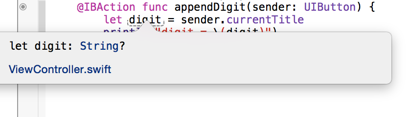
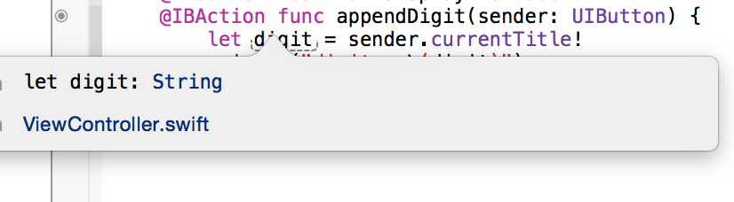
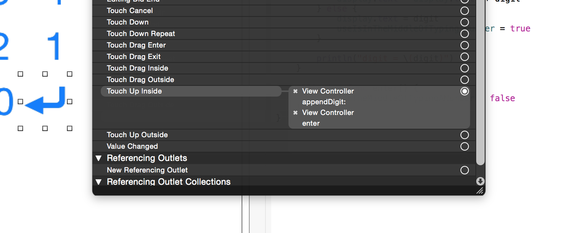

  

### 1 iOS8 Overview
- iOS UI为什么一开始是方的？  
	+ 约束  
 	+ 对于任何方向的任何设备被压扁时应该如何显示  
	+ 一开始label在屏幕的外面，需要给label一些约束（当屏幕在被压缩时如何显示）
		* 固体边到边缘的长度（使所有宽度都会由另一方决定）
		* ctrl+拖动 `tralling space to container margin`(与容器之间的间距 )
		* 橙色线是UI警告，蓝色是UI正确
		* 当UI不明确时，查看左下角show document outline
		* document outline右上角的黄色箭头就是查看橙色线的警告
		* 黄色三角形 显示UI错误的修改方案 **update Frame**
		* 上述过程也就是 Auto layout
- 代码和UI交流	Assistant Editor(右上角两个圆圈)
	+ `import`	一般只是引入框架时才会需要
	+ swift是单继承，只能继承一个类
	+ view的controller必须继承于`UIViewController`(或在其继承链上)
	+ 通过ctrl+拖动 把UI中label连接到代码中
		* 连接方式 outlet(代表指向属性或实例变量) action(方法)
		* weak(storage,存储方式)
		* `@IBOutlet weak var display: UILabel!`
		* `@IBOutlet`不是swift语法，只是Xcode的一个标志 
		* 代码最左侧的黑色小点是Xcode方便寻找代码对应的UI的一个标志
		* 在swift中不需要注意垃圾回收等内存管理，所有类，类的实例都存在堆(heap)中 
	+ 通过ctrl+拖动 把UI中button连接到代码中
		* 连接方式 action
		* type UIButton
		* arguments sender
		* `@IBAction`
		* 熟练的使用文档，Xcode已经完美嵌入文档支持 option
		* 访问属性用. 
	+ **optional**	
			
		
		* swift是非常强类型的语言
		* **optional**有两种值：`not set`(未设，nil)	`something`
		* `String?`表示是optional string类型值，如果有值就是String类型的值
		* 通过!对optional值unwrap，结果是为nil时程序crash，其他状况为对应的值（上面的情况就是string）  
			
		* 在swift中当一个对象初始化了，那么它的所有属性都必须初始化
		

### 2 
- 1中得问题：UILabel后为啥是!,而不是？
	* implicitly unwrapped optional(隐式)  这类属性在创建时已经	赋值，并且一直是赋值的  （sugar， 语法的甜头）
	* 变量display(UILabel)在左侧视图被视图控制器加载时已经赋值
- 在计算机中加入 return键 可从 edit->emoji&  中搜索想要的图标
- 右击某个button可看到
	
	+ return按钮被两个控制器控制
- **计算性属性**

