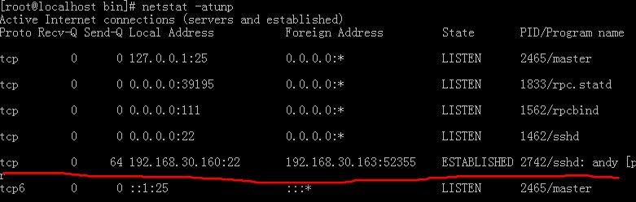

### linux常用网络指令
1. 网络参数设定命令
   - `/etc/sysconfig/network-scripts/`目录中各种配置脚本
   - `ifconfig`
   
			[root@localhost network-scripts]# ifconfig
			eno16777736: flags=4163<UP,BROADCAST,RUNNING,MULTICAST>  mtu 1500
			        inet 192.168.30.160  netmask 255.255.255.0  broadcast 192.168.30.255
			        inet6 fe80::20c:29ff:fef0:632b  prefixlen 64  scopeid 0x20<link>
			        ether 00:0c:29:f0:63:2b  txqueuelen 1000  (Ethernet)
			        RX packets 27115  bytes 5969948 (5.6 MiB)
			        RX errors 0  dropped 0  overruns 0  frame 0
			        TX packets 3387  bytes 1719224 (1.6 MiB)
			        TX errors 0  dropped 0 overruns 0  carrier 0  collisions 0
			
			lo: flags=73<UP,LOOPBACK,RUNNING>  mtu 65536
			        inet 127.0.0.1  netmask 255.0.0.0
			        inet6 ::1  prefixlen 128  scopeid 0x10<host>
			        loop  txqueuelen 0  (Local Loopback)
			        RX packets 80  bytes 5020 (4.9 KiB)
			        RX errors 0  dropped 0  overruns 0  frame 0
			        TX packets 80  bytes 5020 (4.9 KiB)
			        TX errors 0  dropped 0 overruns 0  carrier 0  collisions 0
		
	  +  `eth0` 网卡代号 ，cetos7改成`eno16777736`,lo是loopback
	  +   MTU (Maximum Transmission Unit,最大传输单位)
	  +   txqueuelen：用来传输数据的缓冲区的存储长度
	  +   RX：网络有启动到目前的封包接收情况
	  +   TX：封包传送情况
	  +   collisions：封包碰撞情况，太多表示网络不好
  - `ifconfig eth0 192.168.100.100` 临时改变网卡ip，远程终端修改会掉线
  - `ifconfig eth0 192.168.100.100  netmask 255.255.255.128 mtu 8000` 同时设定不同网络接口
  - `ifconfig eth0 up | down`
  - `/etc/init.d/network restart` 以上手动设定的网络参数全部失效，会以`/etc/sysconfig/network-scripts/ifcfg-eno16777736`等的设定为标准
  - `ifup eth0`,`ifdown eth0` 这两个程序搜索/etc/sysconfig/network-scripts目录下ifcfg-*来启动与关闭。 当目前的网络参数与ifcfg-*不相符，就不能执行，也就是用ifconfig临时修改网络参数要已`ifconfig eth0 down`来关闭
  - 查看局域网中的ip `sudo yum install nmap` `nmap -sP 192.168.30.0/24`
  -  `route`   路由 ？？？
  -  `ip` 网络参数综合指令    
     + `ip link` 装置接口相关设定  （osi第二层）
     	 + `ip link show`
     	 + `ip -s link show eth0`
     	 + `ip link set eth0 up | down`
     	 + `ip link set eth0 mtu 1000`
     	 + `ip link set eno16777736 name andy` 修改网络卡名，需关闭
     + `ip address` 额外的ip相关设定 （osi第三层）
     	 + `ip address show` 
     	 + `ip address add`
     	 + `ip address del`
     + `ip route` 路由的相关设定
     	 + `ip route show`
     	 + `ip route add`
     	 + `ip route del`
   - 无线网络： `iwlist` `iwconfig`
   - `dhclient eno16777736` 手动设定网卡亿dhcp协议去尝试取得ip

2. 网络侦错与观察指令
<<<<<<< HEAD
	 - 
=======
   - `ping` 两部主机沟通。ICMP封包（type 0,8），IP封包，TTL属性
      + `ping -c 3 168.192.30.140` 发送3次包
      + `ping`最简单功能是传送ICMP封包去要求对方主机回应是否存在于网络环境
      + 测试某个网域中主机是否响应 ping.sh  
	      		
				#! /bin/bash
				for siteip in $(seq 1 254)
				do
				        site="192.168.30.${siteip}"
				        ping -c1 -W1 ${site} &> /dev/null
				        if [ "$?" == "0" ]; then
				                echo "$site is UP"
				        else
				                echo "$site is DOWN"
				        fi
				done
      + 主机和待测主机在同一网域时，TTL是64，否则是255
      + 用ping追踪路径中的最大MTU数值 `ping -c 2 -s 1000 -M do 192.168.30.212`
      + 不同接口的MTU值是不同
   - `traceroute` 两主机间各个节点分析
	      > -n 主机名称  
	      > -U 默认是UDP的port 33434  
	      > -I 使用ICMP方式进行侦测  
	      > -T TCP 默认port 80  
	      > -w 限制时间  
	      > -p 端口  
	      > -i -g  
      + `traceroute -n tw.yahoo.com`
      +  回传星号的，代表该 node 可能设有某些防护措施，让我们发送的封包信息被丢弃所致。 因为我们是直接透过路由器转递封包，并没有进入路由器去取得路由器的使用资源，所以某些路由器仅支持封包转递， 并不会接受来自客户端的各项侦测.
      + `traceroute -w 1 -n -T tw.yahoo.com`
   - `netstat` 本机网络连接状况
      + `netstat -rn` 路由表状态，类似`route -n`
      + `netstat -an` 列出所有网络联机状态 。两部分（TCP/IP的网络接口部分，传统的Unix socket部分）
      + 两个问题：目前开了多少port在等待客户端的联机？ 有多少联机已建立或产生问题？  
      
	  + 上图划线处表示目前putty客户端和虚拟机之间的网络链接
	  + Client 端是随机取一个大于 1024 以上的port 进行联机，只有 root 可以启动小于 1024 以下的 port 
	  + `/etc/services` 保存着port和number一一对应
   - `host` `nslookup` 主机名与ip对应
      + `host tw.yahoo.com` 根据`/etc/resolv.conf`中规定的DNS服务器查询主机ip，也可以指定dns服务器
      + `host tw.yahoo.com 168.95.1.1`
      + `nslookup www.google.com`
      + `nslookup 168.95.1.1` 找出168.95.1.1的主机名
      
3. 远程联机指令与实时通讯软件
   - telnet
   - `ftp 192.168.30.30 44446`	ftp会使用两个port分别进行命令与数据的交流
   - `lftp`
   - `pidgin`
4. 文字接口网页浏览
   - `links` 文字浏览器 类似于`lynx`
      + `links http://www.kernel.org`
      + `links /usr/share/doc/HTML/index.html`
      + `links -dump http://tw.yahoo.com > yahoo.html`
   - `wget`
   - `wget  http://www.kernel.org/pub/linux/kernel/v2.6/linux-2.6.39.tar.bz2`  通过http下载
   - `/etc/wgetrc`
5. 封包截取功能 ？？
   - `tcpdump`
   - `wireshark`
   - `nc` `netcat`

### linux网络侦错
>>>>>>> 2d76a798bf95162a6b704edfcfd6b57d9152ed52
