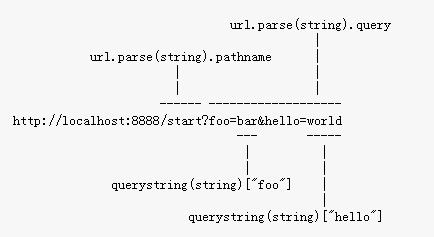

## 安装nodejs（win7)
- 下载	[node-v0.10.35-x64.msi](http://nodejs.org/download/)
- 安装nodejs
	* 自定义安装在D:\dev\nodejs下面
	* 改变环境变量 PATH
	* cmd测试 `node -v` `npm -v`(新版nodejs已集成npm)
	* `npm config ls` 查看配置
	* `npm comfig set prefix "d:\dev\nodejs"` 修改prefix
- 安装相关环境
	npm install express -g 
	npm install jade -g
	npm install mysql -g
## just start
- Node.js事实上就是另外一种上下文。
- Node.js事实上既是一个运行时环境，同时又是一个库
## web应用不同模块分析
- HTTP服务器
- 路由
- **请求处理程序（request handler）**
- **请求数据处理功能**
- **试图逻辑**	数据内容展示
- **上传处理功能**
## start
- 大部分服务器都会在你访问 http://localhost:8888 /时尝试读取 http://localhost:8888/favicon.ico
- 服务端模块	server2.js
- 进行请求的*路由*：查看HTTP请求，从中提取出请求的URL以及GET/POST参数。这些数据堵在request对象中  

# 再次学习
[1](http://www.runoob.com/nodejs/nodejs-tutorial.html)  
[2](https://nqdeng.github.io/7-days-nodejs/#1)  
[3](http://www.nodebeginner.org/index-zh-cn.html)

----------

### npm的使用 
    - 安装包
        npm install express          # 本地安装
        npm install express -g   # 全局安装

        + 本地安装
            1. 将安装包放在 ./node_modules 下（运行 npm 命令时所在的目录），如果没有 node_modules 目录，会在当前执行 npm 命令的目录下生成 node_modules 目录。
            2. 可以通过 require() 来引入本地安装的包。
        + 全局安装
            1. 将安装包放在 /usr/local 下或者你 node 的安装目录。  /usr/local/lib/node_modules/npm
            2. 可以直接在命令行里使用。
    - 查看安装的包

        + npm ls -g
        + npm ls 
    - 卸载模块
        + npm uninstall express
    - 更新模块
        + npm update express

    - 搜索模块(第一次有点慢)
        + npm search express

    - registry
        npm update 命令怎么知道模块是否有最新版呢？ 向 https://registry.npmjs.org/ 查询
        查看react版本信息 https://registry.npmjs.org/react    https://registry.npmjs.org/react/v0.14.6 
        或者 `npm view react`  
        - 结果中 dist.tarball 是该版本压缩包的网址， npm install和npm update都是通过这中方式安装模块

    - 缓存目录

    http://www.ruanyifeng.com/blog/2016/01/npm-install.html
