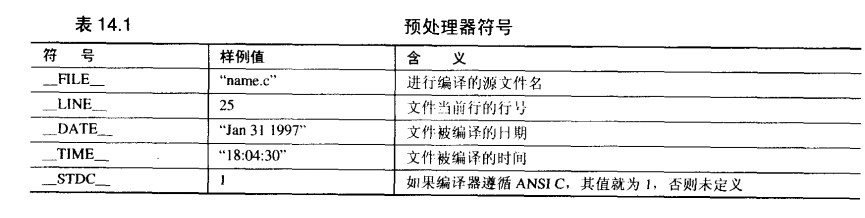
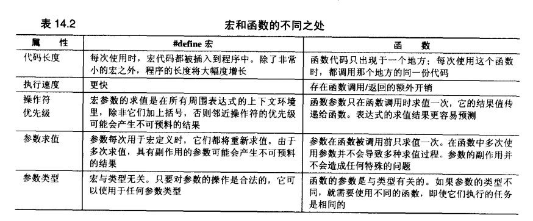

###　预处理器（preprocessor）
> 编译器的一些文本性质的操作：   
> 1. 删除注释  
> 2. 插入被#include指令包含的文件的内容，定义  
> 3. 替换由#define指令定义的符号
> 4. 确定代码的部分内容是否应该根据一些条件编译指令进行编译

1. 预定义符号  

2. #define
	- `#define name stuff`	为数值或文本命名一个符号	
	- 宏		`#define name(parameter-list) stuff`
		+ 参数列表的左括号必须与name紧邻
		+ 所有用于对数值表达式进行求值的宏定义都应该用这种方式加上括号，避免在使用宏时，由于参数中的操作符或邻近的操作符之间不可预料的相互作用
	- 相邻的字符串常量被自动连接为一个字符串。
	- 不应该在宏定义的尾部加上分号  
	- #define 替换步骤
		+ 调用宏时，先检查参数是否有#define定义符号
		+ 替换文本
		+ 再次对结果文本查看是否有#define定义的符号
	- 宏不可以递归
	- `##` 表示两边的符号连接成一个符号
	
			int sum5=0;
			#define ADD_TO_SUM(sum_number,value)	sum ## sum_number += value
			ADD_TO_SUM(5,25);	// 替换成 `sum5 += 25;`
	- 宏与函数
		+ 宏的优势
			* 规模和速度更优
			* 函数的参数必须声明为一种特定的类型，宏是与类型无关的。
			
					#define MALLOC(n, type) \
        				( (type *)malloc( (n) * sizeof(type) ) )

					pi = MALLOC(25, int);	// type是一个类型，不能作为函数参数
		+ 宏的劣势
			* 宏长时，会增加程序的长度
	- 带副作用的宏参数
		+ 副作用就是在表达式求值时出现的永久性效果
			*　x++
			*　getchar()将“消耗”输入的一个字符

	
	  

	- `#undef name`	移除一个宏定义
	- 命令行定义	把诸如数组长度（不同机器在）常量定义到命令行中 

3. 条件编译(conditional compilation)
	
		#if	constant-expression
			statemetns
		#endif
	> 1. 正常编译还是完全忽略  
	> 2. 编译时选择不同的代码
	
	- 是否被定义
	
			#if		defined(symbol)
			#ifdef	symbol
		
			#if		!defined(symbol)
			#ifndef	symbol
	- 嵌套指令
	
4. 文件包含
	- 函数库文件包含		`#include <filename>`
	- 本地文件包含		`#include "filename"`
	- 嵌套文件包含	
		+ 少嵌套，会很难判断文件之间的真正依赖关系
		+ 消除多重包含，在所有头文件中编写：

				#ifndef		_HEADERNAME_H
				#define		_HEADERNAME_H	1
				
				#endif
	
	