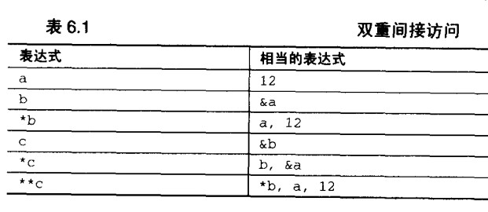

### 指针
1. 内存和地址
   - 内存中的每个位置有一个独一无二的地址标识
   - 内存中的每个位置都包含一个值
   - 变量名与内存位置之间的关联是由编译器实现的，硬件仍然通过地址访问内存位置。
2. 值和类型
   - 不能简单地通过检查一个值的位来判断它的类型
   - 值的类型并非值本身所固有的一种特性，而是取决于它的使用方式
3. 指针变量的内容
   - 变量的值就是分配给该变量的内存位置所存储的数值，即使是指针变量也不例外。
4. 间接访问操作符
5. 未初始化和非法的指针
   - `int *a; *a=12;` 指针变量a没有具体的指向那个内存位置
   - UNIX上，报错**段违例（segmentation violation）** 或 **内存错误（memory fault）** 提示程序试图访问一个并未分配给程序的内存位置。
   - windows，对未初始化或非法指针进行间接的访问操作是**一般保护性异常（General Protection Exception）**的根源之一
   - 在对指针进行间接访问之前，确保它们已被初始化。
6. NULL指针
   - NULL表示某个特定的指针目前并未指向任何东西
   - 用一个单一的值表示两种不同的意思是件危险的事，因为将来很容易无法弄清哪个才是它真正的用意。
   - 对所有的指针变量进行显式的初始化是中好做法。
7. 指针、间接访问和左值
8. 指针、间接访问和变量
9. 指针常量
10. 指针的指针 

		int a = 12;
		int *b = &a;
		int **c = &b;
	
11. 指针表达式  
    `char ch = 'a'; char *cp = &ch;`  
   - `&ch`
   - `cp`
   - `&cp`
   - `*cp`
   - `*cp + 1`
   - `*(cp + 1)`
   - `++cp`
   - `cp++`
   - `*++cp`
   - `*cp++`
   - `++*cp`
   - `(*cp)++`
   - `++*++cp`
   - `++*cp++` 
13. 指针运算
   - 算术运算
      + `指针 +- 整数` 只能用于指向数组中某个元素的指针
      + `指针 - 指针` 只有两个指针都指向同一个数组中的元素（结果是ptrdiff_t类型,一种有符号整数类型）
      + 越界指针和指向未知值的指针是两个常见的错误根源
   - 关系运算