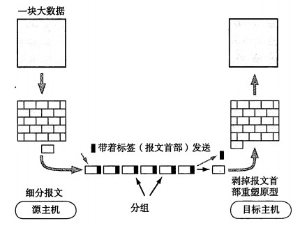
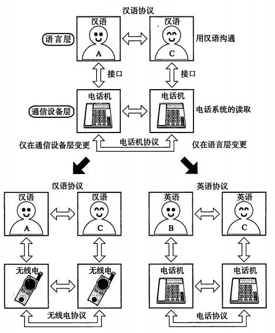
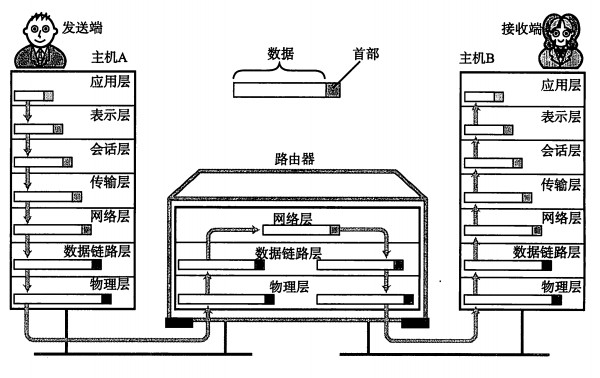
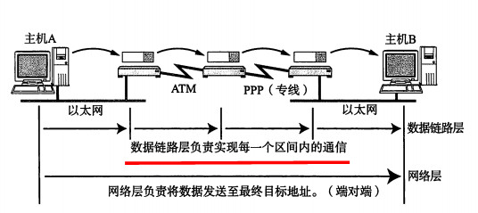
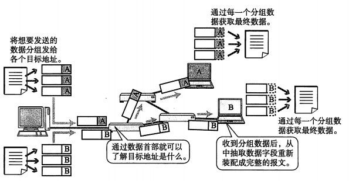
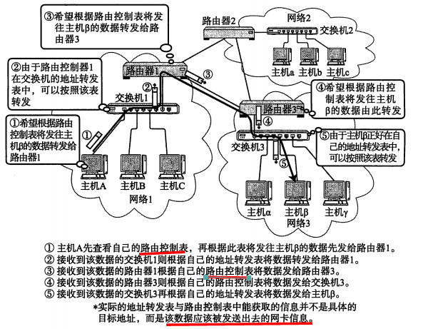

#《图解tcp_ip》笔记

## 0 前言
- TCP/IP链接计算机，汽车，家电，计算机系统虚拟化，云计算
## 网络出现背景

### 计算机与网络发展的7个阶段
1. 批处理（batch processing）系统
2. 分时系统（time sharing system ，tss）    独占性
3. 计算机之间的通信    多台计算机分布式处理    通信线路
4. 计算机网络的产生    分组交换技术    窗口系统
5. 互联网的普及
6. 以互联网技术为中心    
7. 从“单纯建立连接”到“安全建立连接”
8. TCP/IP

### 协议
1. 协议就是计算机之间通过网络实现通信时事先达成都的一种“约定”。
2. cpu通常同一时间只能运行一个程序。**乱转机制**	**多任务调度**
3. 人与人之间交流的容错率很高，而计算机不一样，计算机之间交流要注意“**应对异常**”。
4. **分组交换协议** 是将大数据分割成包（packet）的较小单位进行传输的方法。

### 协议分层
> "接口" 上下层之间交互所遵循的约定
> "协议" 同一层之间交互所遵循的约定

1. 分层的优势：**独立使用**（扩展灵活），**细分通信功能**。  
分层的劣势：过分模块化，使处理变得更加沉重以及每个模块都不得不实现相似的处理逻辑

### OSI参考模型
1. OSI协议与OSI参考模型 （Open System Interconnection）
2. osi参考模型举例
  

 * 应用层 
 * 表示层：将数据从主机特有的格式转换为网络标准传输格式。不同计算机对数据在内存中相异的分配方式（如：大实体和小实体）
 * 会话层：决定采用哪个链接发送（何时连接，何时发送，但没有实际传输数据的功能）  
 *应用层写入数据经表现层格式化编码，再由会话层标记发送顺序*
 * 传输层：实际传输数据
 * 网络层与传输层相互协作以确保数据包能够传送的世界各地，实现可靠传输
 * 数据链路层通过传输介质互连的设备之间进行数据处理
 * 物理层将数据的0、1转换为电压和脉冲传输给物理的传输介质，而相互直连的设备之间使用地址（**MAC地址**）实现传输
 

### 传输方式的分类

1. 面向有连接型与面向无连接型
2. 电路交换和分组交换
3. 根据接收端数量分类
 * 单播（unicast）
 * 广播（broadcast)	电视播放
 * 多播（multicast）	电视会议
 * 任播（anycast）	DNS根域名解析服务器

### 地址
1.地址的唯一性  	在同一个通信网络中不允许有两个相同地址的通信主体存在。
2.地址的层次性	ip地址具有层次性  
MAC寻址：地址转发表  
IP地址：路由控制表

### 网络的构成要素

